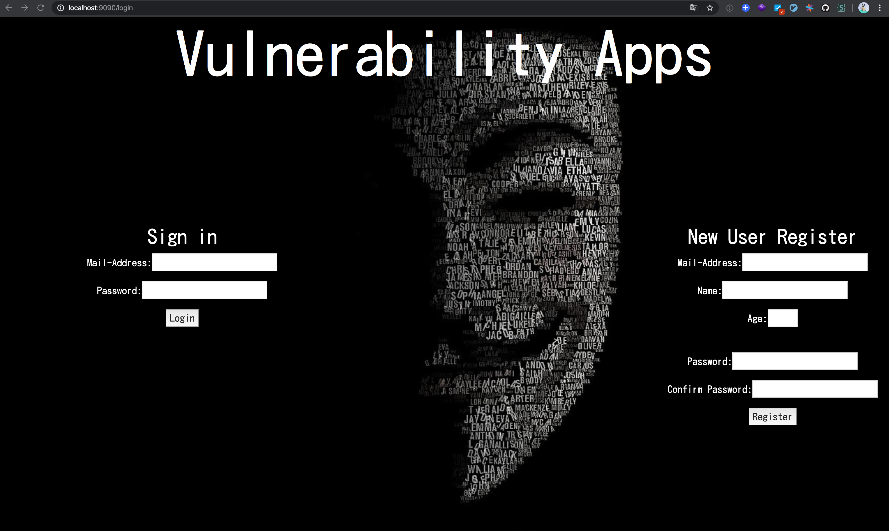

refactor/LocalAndDocument
Vulnerability-goapp
====
Overview

This Web application was build for learning Web application vulnerability (ex. SQL injection, XSS, CSRF)


## Description
Vulnerability Web application build Golang
This Web application was build for learning Web application vulnerability (ex. SQL injection, XSS, CSRF)
It can be used local for learning by yourself 

### Requirement

- docker
- docker-compose

### install

```
$ git clone https://github.com/Snow-HardWolf/Vulnerability-goapp.git

$ cd Vulnerability-goapp

$ docker-compose -f runenv/docker-compose-local.yml up -d
Starting vulnapp-mysql    ... done
Starting vulnapp-csrftrap ... done
Starting vulnapp-goapp    ... done
```

**confirm**

```
$ docker-compose -f runenv/docker-compose-local.yml ps
      Name                    Command               State           Ports
----------------------------------------------------------------------------------
vulnapp-csrftrap   sh -c apk add git && go ge ...   Up      0.0.0.0:3030->3030/tcp
vulnapp-goapp      sh -c apk add git mysql-cl ...   Up      0.0.0.0:9090->9090/tcp
vulnapp-mysql      docker-entrypoint.sh mysql ...   Up      0.0.0.0:3306->3306/tcp
```

### Access

Open 'localhost:9090/login'
Open 'localhost:3030/csrftrap'


## fix

If you get error of csrftrap container

```
# cd .; git clone -- https://go.googlesource.com/xerrors /go/src/golang.org/x/xerrors
Cloning into '/go/src/golang.org/x/xerrors'...
fatal: unable to access 'https://go.googlesource.com/xerrors/': The requested URL returned error: 502
package golang.org/x/xerrors: exit status 128
```

I fixing this error

## Next Feature

Add some vulnerabilities


## Author

[snow-harwolf](https://github.com/Snow-HardWolf)


# Vulnerability-goapp
Vulnerable golang Web application for education

## Note
This application has some vulnerabilities
So, Use for educational or research purposes only 

## Run-Environmant

- docker-compose
  - golang
    - Vulnerability Application
    - CSRF-Trap Application
  - MySQL

## Image



## How to Run

#### docker-compose
1. cd Vulnerability-goapp
2. docker-compose up

#### Web Application
1. Access 'http://localhost:9090/login' on browser ( Google Chrome recommended )


#### CSRF-TRAP-Application
1. Access 'http://localhost:3030/scrftrap' on browser ( Google Chrome recommended )

*Note: If you run this app on SaaS (like EC2), CSRF-TRAP-Application view pages(HTML) need to change redirect form destination suit for running-environmant*

[./Trap](https://github.com/Hardw01f/Vulnerability-goapp/tree/docs/ModifyReadme/Trap)

*Note. CSRF will be expressed when you access this page, so please be careful when access this page*

### First Users

```
MailAddress: RX-78-2@EFSF.com
Password : Amuro,Ikima-su!
```

```
MailAddress: MS-06-S@Zeon.com
Password : AkaiSuisei
```

### Admin Pages

1. login some user and go top page
2. go 'http://localhost:9090/adminlogin'

```
AdminMailAddress: admin@admin.com
Password : Qwerty1234
``` 

### The Payloads

[Payloads](https://github.com/Hardw01f/Vulnerability-goapp/blob/docs/ModifyReadme/Payloads.md)
master
